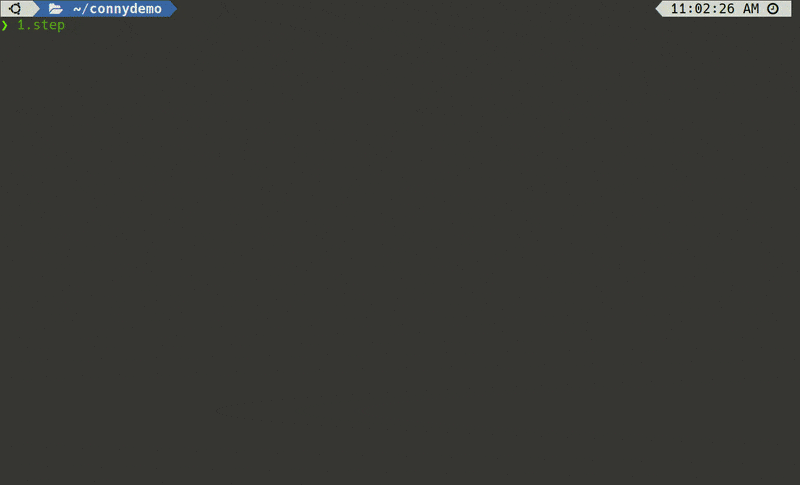
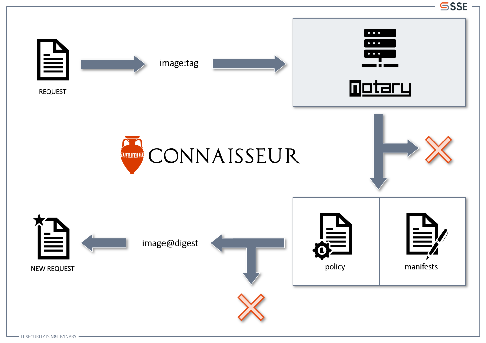
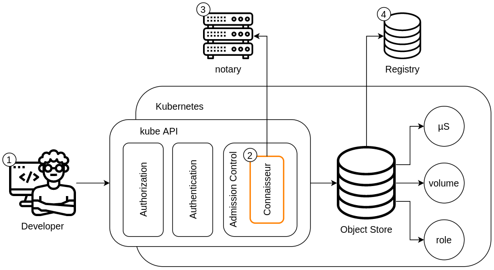

[](https://github.com/sse-secure-systems/connaisseur/blob/master/LICENSE)
[](https://codecov.io/gh/sse-secure-systems/connaisseur)


<!-- # Connaisseur -->

Connaisseur is an admission controller for Kubernetes that integrates Image Signature Verification and Trust Pinning into a cluster, as a means to ensure that only valid images are being deployed.

🚨 🚨 We have added experimental support for [Cosign](https://github.com/sigstore/cosign) from the [Sigstore Project](https://sigstore.dev/). You can find instructions [here](setup/COSIGN.md). 🚨 🚨

Have feedback? Feel free to [reach out to us](https://github.com/sse-secure-systems/connaisseur/discussions)!

## Contents

- [Introduction](#introduction)
- [Demo](#demo)
- [How it works](#how-it-works)
- [Getting Started](#getting-started)
  * [Makefile and Helm](#makefile-and-helm)
  * [Image Policy](#image-policy)
  * [Detection Mode](#detection-mode)
  * [Alerting](#alerting)
- [Threat Model](#threat-model)
  * [(1) Developer/User](#-1--developer-user)
  * [(2) Connaisseur Service](#-2--connaisseur-service)
  * [(3) Notary Server](#-3--notary-server)
  * [(4) Registry](#-4--registry)
- [Additional Information](#additional-information)
- [Discussions, Support & Feedback](#discussions-support--feedback)
- [Contributing](#contributing)
- [Security Policy](#security-policy)
- [Contact](#contact)

## Introduction

In the last few years, deploying applications became increasingly easy, thanks to the containerization technology popularized by *Docker* and *Kubernetes*. All one needs is an image name, maybe some configuration parameters and woosh: your application is running. This convenience is further increased by the ease of distributing those images, with *Docker Hub*, the *Google Container Registry* and the likes. Together, this allows deploying whole infrastructures in mere seconds – nay – nanoseconds!

However, as one might have already guessed, this convenience has its drawbacks. The contents of an image are not always evident at a glance, and could include rather unwanted or even malicious components. This holds true for images from public registries, but also for self-built ones (from your pipelines). Obviously, there is a need for protecting one's images from malicious modifications, and luckily, there is!

Enter [*Docker Content Trust (DCT)*](https://docs.docker.com/engine/security/trust/), a solution that offers a way to digitally sign images. It uses *Notary*, an implementation of *The Update Framework*, to store a manifest file linking the latest image digest with its tag, which then is signed with a private key. As the digest uniquely identifies an image with specific contents, this allows making a cryptographic guarantee about the integrity of an image based on its tag. DCT can be used on Docker Hub to sign images and overall offers a good experience with Docker. Sadly, it does not work with Kubernetes out of the box, even though Kubernetes uses Docker. Kubernetes is unaware whether the underlying Docker daemon has DCT enabled or not, and deploys any kind of images, regardless of their signature status.

**Connaisseur** solves this problem by bringing image signature verification into Kubernetes. It uses the already existing Docker Content Trust solution and adds it to the cluster as a mutating admission controller. It pulls trust data from *Notary* and verifies it before any commitment to Kubernetes happens.

## Demo

We provide two public sample images for testing. Setting the trust anchor of Connaisseur to our public key allows you to have a working demo in just a few minutes. Below, you see a full setup starting a [MicroK8s](https://microk8s.io/) test cluster, installing of Connaisseur and testing with a signed and unsigned image.



Make sure `docker`, `git`, `helm`, `kubectl`, `make` and `yq` (>= v4) are installed. Your `kubectl` context should be set to your Kubernetes test cluster.

> :warning: Do not start this on a cluster used for other purposes, as Connaisseur will block all deployments!

- Clone the repository via `git clone https://github.com/sse-secure-systems/connaisseur.git` and set the trust anchor to our public key in the `helm/values.yaml`. For that, add the following lines to the already existing `default` notary configuration:

```yaml
notaries:
- name: dockerhub
  host: notary.docker.io
  root_keys:
  - name: library
    key: ...
  # -- Add this part ----
  - name: securesystemsengineering
    key: |
      -----BEGIN PUBLIC KEY-----
      MFkwEwYHKoZIzj0CAQYIKoZIzj0DAQcDQgAEsx28WV7BsQfnHF1kZmpdCTTLJaWe
      d0CA+JOi8H4REuBaWSZ5zPDe468WuOJ6f71E7WFg3CVEVYHuoZt2UYbN/Q==
      -----END PUBLIC KEY-----
  # ---------------------
```

- Also in the `helm/values.yaml` add a new pattern to the `policy` field, referencing the notary entry and key:

```yaml
policy:
- pattern: "*:*"
  verify: true
- pattern: "docker.io/securesystemsengineering/connaisseur:*"
  verify: false
# -- Add this part ----
- pattern: "docker.io/securesystemsengineering/testimage:*"
  verify: true
  notary: dockerhub
  key: securesystemsengineering
# ---------------------
```

- Install Connaisseur on the cluster via `make install`.
- Trying to deploy an unsigned app to your cluster will be denied due to lack of trust data: `kubectl run unsigned --image=docker.io/securesystemsengineering/testimage:unsigned`
- However, the signature of our signed image is successfully verified: `kubectl run signed --image=docker.io/securesystemsengineering/testimage:signed`
- You can compare the trust data of the two images via `docker trust inspect --pretty docker.io/securesystemsengineering/testimage`.
- To uninstall Connaisseur from your cluster after the demo, run `make uninstall`.

Congrats :bowtie:! You have successfully validated authenticity and integrity of our test images before deploying to your cluster. Below you can find a guide how to setup Connaisseur in your own environment.

## How it works

**tl;dr:** Connaisseur acts as a Kubernetes Mutating Admission Webhook that intercepts requests to the cluster and ensures that the `image:tag` included in a deployment request is transformed into a trusted and cryptographically verified `image@digest` with its unaltered content. The trusted image digest is then used for starting containers in the Kubernetes cluster.

In more detail: a deployment request will be sent to the Connaisseur admission controller before it gets committed to the cluster. Connaisseur then looks at all images included in the request that are to be committed (1) and accesses their trust data from a Notary server using its API (2). Should there be no trust data for an image, the initial request is denied and nothing is committed to the cluster. Otherwise the trust data is inspected further (3): It contains a digest corresponding to the requested image, which in turn uniquely identifies an image and its content. The trust data also has a signature which Connaisseur verifies in order to prove the image digest's legitimacy.



Notary trust data includes some auxiliary information on the freshness of each image's digest, all of which are signed and require cryptographic verification as well. Connaisseur takes care of that and validates the full signature chain in order to ultimately infer trust in the image digest (4). Besides, Connaisseur honors a configurable image policy, which allows to automatically permit certain images that may not need any signatures, or to [define custom delegation roles](ADVANCED.md#delegation-feature) (requiring signatures by specific signers). This policy is held against the received trust data, and together with the signature verification it either results in a rejection of the original request or in a trusted digest (4). The image digest then will be embedded into a new request that is passed on for further processing and eventual commitment (5).

## Getting Started

Connaisseur can be integrated into a multitude of different systems, with a few requirements and a bit of configurational effort. It was tested on a Linux Mint 19.2, but other distributions should work just fine. We provide a [full setup guide](setup/README.md) with detailed instructions for various environments. In short:

1. **Requirements**: First of all you'll need an image with an exiting signature. If you don't have one, head to the [full setup guide](setup/README.md) where creating Docker Content Trust keys and signing images is explained. Also a few tools are needed in advance. You'll need `git` for getting the source code and `make` for a convenient setup. Since Connaisseur will be deployed as a container to a Kubernetes cluster, [docker](https://docs.docker.com/v17.09/engine/installation/linux/docker-ce/ubuntu/), [helm](https://helm.sh/docs/intro/install/) and [kubectl](https://kubernetes.io/docs/tasks/tools/install-kubectl/) are required for building the image, generating a Deployment file and deploying it to the cluster. During the deployment, some certificates need to be created, which requires `openssl`. To install everything except docker, helm and kubectl, use

```bash
sudo apt install git make openssl -y
sudo snap install yq
```

2. **Getting the code**: Clone this repository to your favorite location.

```bash
git clone git@github.com:sse-secure-systems/connaisseur.git
```

3. **Configure deployment**: Before deploying Connaisseur to your cluster, you may want to do some configuration to ensure smooth integration with the other system components. Open `helm/values.yaml`, which is Connaisseur's configuration file.

    1. **Configure notary instances**: The `.notaries` field specifies different notary configurations, with the official DockerHub notary instance predefined. When wanting to add a new (e.g. private) notary instance, create a new entry and define a `name` and add the host address in the `host` field. Should the new instance use a self-signed certificate, add it with the `selfsigned_cert` field in a PEM format. Also should the instance need authentication, an `auth` field can be added, containing either an `auth.user` and `auth.password` with the credentials, or an `auth.secretName` referencing a predefined secret. Regardless of whether you want to add a new instance or use the DockerHub one, you'll probably want to add at least one public root key, used for verifying the signatures. Root keys reside in the `root_keys` field as a list. The public key for all official images on DockerHub is already defined with the name `default`. Simply add a new entry, give it a `name` and add the key in PEM format in the `key` field. For retrieving a public root key you can use the *get_root_key* utility described [here](#getting-the-root-key).

    2. **Configure the policy**: To actually use the newly defined notary instances or public keys, they have to be referenced in the image policy. How the image policy is setup, is described in the [image policy](#image-policy) section. Make sure to reference the instance and key via the `notary` and `key` fields, or leave them out should you want to use the default ones, which are identified by their `name` fields set to `default`.

4. **Deploy**: Switch to the cluster where you would like to install Connaisseur, and run `make install`. This may take some seconds, as the installation order of the Connaisseur components is critical. Only when the Connaisseur pods are ready and running, the Admission Webhook can be applied for intercepting requests.

> :warning: **WARNING!** Be careful when installing Connaisseur, as it will block unsigned images and may for example even block some resources during a restart of `minikube`! In such a situation you should still be able to fix it by deleting Connaisseur manually. You can use [Detection Mode](#detection-mode) to avoid interruptions during testing.

### Makefile and Helm

The recommended approach on installing Connaisseur is using the Makefile, as it conveniently creates the `connaisseur` namespace, switches to it and then uses Helm to install Connaisseur. Some useful commands are:

- `install` - for installation Connaisseur, including its namespace
- `upgrade` - for upgrading your currently installed Connaisseur release
- `uninstall` - for uninstalling Connaisseur and deleting the `connaisseur` namespace
- `annihilate` - for deleting all Connaisseur related resources, whether they are namespaced or not (usually only used when something went wrong during installation)

Another way is to just use Helm for this, without relying on the Makefile. When doing so, make sure to add the `--wait` flag for `install` and `upgrade` commands, as the installation order and readiness states of all components are critical. Otherwise your installation/upgrade will probably fail.

### Image Policy

Connaisseur allows defining an image policy, for fine-grained control over Connaisseur's judgments on different images. When installing the tool, a default policy (`helm/values.yaml#policy`), is applied to the cluster:

```yaml
policy:
- pattern: "*:*"
  verify: true
- pattern: "k8s.gcr.io/*:*"
  verify: false
- pattern: "docker.io/securesystemsengineering/connaisseur:*"
  verify: false
- pattern: "sample.registry.io/image:*"
  verify: true
  delegations:
  - lou 
  - max
  notary: sample-notary
  key: sample-key
```

The policy consists of a set of rules. Each rule starts with a pattern that needs to be matched to an image name (such as `"*:*"` and `"docker.io/*:*"`). Only the most specific rule, with the most specific matching pattern, is chosen for any given image. This is determined by the following algorithm:

1. A given image is matched against all rule patterns.
2. All matching patterns are compared to one another to determine the most specific one (see below). Only two patterns are compared at a time; the more specific one then is compared to the next one and so forth. Specificity is determined as follows:
    1. Patterns are split into components (delimited by "/"). The pattern that has a higher number of components wins (is considered more specific).
    2. Should the two patterns that are being compared have equal number of components, the longest common prefix between each pattern component and corresponding image component are calculated (for this purpose, image identifiers are also split into components). The pattern with the longest common prefix in one component, starting from the leftmost, wins.
    3. Should all longest common prefixes of all components between the two compared patterns be equal, the pattern with a longer component, starting from the leftmost, wins.
    4. The rule whose pattern has won all comparisons is considered the most specific rule.
3. Return the most specific rule.

In addition to the pattern, rules can also contain a `verify` flag which specifies whether the image requires a signature or can skip verification. If `verify` is set to `true`, a valid signature is required; otherwise, the image is admitted without verification. The default value for `verify` is `true`. Additionally, a rule can have `delegations` which correspond to Notary delegation roles. These are to be understood as specific signers that need to be present in the Notary trust data in order for signature verification to be successful (for a more detailed documentation see the [ADVANCED.md](ADVANCED.md#delegation-feature)). Lastly a `notary` and `key` field can be added, which reference which of the notaries should be consulted when accessing signatures for a given image, and which of the keys should be used to verify these signatures. Make sure that the `notary` field references one of the notaries `name` fields and the `key` field references of the public root keys `name` field, within the given notary configuration. If no `notary` or `key` fields are given, Connaisseur will either do one of two things:

1. Should there only be one notary configuration or only one key defined within a given configuration, this configuration or key will be taken by default for verification purposes.
2. Should there be more then one notary configuration or key and if one of the `name` fields is set to `default`, Connaisseur will take this one. If no default is specified and no specific entry defined, Connaisseur will abort the validation with an error.

### Detection Mode

A detection mode is available in order to avoid interruptions of a running cluster, to support initial rollout or for testing purposes. In detection mode, Connaisseur will admit all images to the cluster, but logs an error message for images that do not comply with the policy or in case of other unexpected failures.

To activate the detection mode, set the `detection_mode` flag to `true` in `helm/values.yaml`.

### Alerting

You can receive notification on the admission decisions made by Connaisseur on basically every REST endpoint that accepts JSON payload. For Slack, Opsgenie and Keybase we have preconfigured payloads that are ready to use, but you can also use the existing payload templates as an example how to create your own custom one. It is also possible to configure multiple different interfaces you want to receive alerts at for each event category (admit/deny) in the `helm/values.yaml`.

If you for example would like to receive notifications in Keybase whenever Connaisseur admits a request to your cluster, your alerting configuration would look similar to to following snippet:


```
alerting:
  admit_request:
    templates:
      - template: keybase
        receiver_url: https://bots.keybase.io/webhookbot/<Your-Keybase-Hook-Token>
```

For each element in `templates`, both `template` as well as `receiver_url` are required. The value for `template` needs to match an existing file of the pattern `helm/alert_payload_templates/<template>.json`; so if you want to use a predefined one it needs to be one of `slack`, `keybase` or `opsgenie`. For some REST endpoints like e.g. Opsgenie you need to configure a additional headers which you can pass to `custom_headers` as a list of plain string like e.g. `["Authorization: GenieKey <Your-Genie-Key>"]`. Setting `fail_if_alert_sending_fails` to `True` will make Connaisseur deny images if the corresponding alert cannot be successfully sent. This, obviously, makes sense only for requests that Connaisseur would have admitted as other requests would have been denied in the first place. The setting can come handy if you want to run Connaisseur in detection mode but still make sure that you get notified about what is going on in your cluster. *However, this setting will block everyone from contributing if the alert sending fails permanently. It could occur that your developers are blocked if the third party interface is down because somebody accidentally deleted your Slack Webhook App or your configuration has expired because your GenieKey expired!*

| key                                                |  accepted values                                      | required               |
| -------------------------------------------------- | ----------------------------------------------------  | ---------------------  |
| `alerting.<category>.template`                     | `opsgenie`, `slack`, `keybase` or custom <sup>*</sup> | yes                    |
| `alerting.<category>.receiver_url`                 | string                                                | yes                    |
| `alerting.<category>.priority`                     | int                                                   | no (default: `3`)      |
| `alerting.<category>.custom_headers`               | list[string]                                          | no                     |
| `alerting.<category>.payload_fields`               | subyaml                                               | no                     |
| `alerting.<category>.fail_if_alert_sending_fails`  | bool                                                  | no (default: `False`)  |

<sup>* the basename of a custom template file in `helm/alerting_payload_templates` without file extension </sup>

Along the lines of the templates that are already there you can easily define your custom template for your own endpoint. The following variables can be rendered during runtime into your payload: `alert_message`, `priority`, `connaisseur_pod_id`, `cluster`, `timestamp`, `request_id` and `images`. Rendering is done by Jinja2; so if you want to have a timestamp in your payload later on you can use `{{ timestamp }}` in your template. You can update your payload dynamically by adding payload fields in `yaml` presentation in the `payload_fields` key which will be translated to JSON by helm as is. If your REST endpoint requires particular headers, your can specify them as described above in `custom_headers`.

Feel free to open a PR if you add new neat templates for other third parties!
### Getting the Root Key

For verifying the signatures of images, a public root key is needed, but from where do you get this, especially for public images whose signatures you didn't create? For this we created the *get_root_key* utility. You can use it by building the docker image with `docker build -t get-root-key -f docker/Dockerfile.getRoot .` and the running the image:

```bash
$ docker run --rm notaryrootkey -i securesystemsengineering/testimage
KeyID: 76d211ff8d2317d78ee597dbc43888599d691dbfd073b8226512f0e9848f2508
Key: -----BEGIN PUBLIC KEY-----
MFkwEwYHKoZIzj0CAQYIKoZIzj0DAQcDQgAEsx28WV7BsQfnHF1kZmpdCTTLJaWe
d0CA+JOi8H4REuBaWSZ5zPDe468WuOJ6f71E7WFg3CVEVYHuoZt2UYbN/Q==
-----END PUBLIC KEY-----
```

The `-i` (`--image`) option is required and takes the image, for which you want the public key. There is also the `-s` (`--server`) option, which defines the notary server that should be used and which defaults to `notary.docker.io`.

## Threat Model

The STRIDE threat model has been used as a reference for threat modeling. Each of the STRIDE threats were matched to all entities relevant to Connaisseur, including Connaisseur itself. A description of how a threat on an entity manifests itself is given as well as a possible counter measure.


*images created by monkik from Noun Project*

### (1) Developer/User

| Threat | Description | Counter Measure |
|------------------------|-------------------------------------------------------------------------------------------------------------------------------------------------------------------------------------------------------------------------------------|------------------------------------------------------------------------------------------------------------------------------------------------------------------------------------------------------------------------------------------------------------------------------------------------------------------------------------------------------|
| Spoofing | A developer could be tricked into signing a malicious image, which subsequently will be accepted by Connaisseur. | **Security Awareness:** Developers need to be aware of these attacks, so they can spot any attempts. |
| Elevation of privilege | An attacker could acquire the credentials of a developer or trick her into performing malicious actions, hence elevating their privileges to those of the victim. Depending on the victim's privileges, other attacks may be mounted. | **RBAC & Security Awareness:** With proper Role-Based Access Control (RBAC), the effects of compromising an individual's account would help limit its impact and may mitigate the privilege escalation, of course depending on the victim's access level. Other than that, a security awareness training for developers can help minimize the chances of losing critical credentials. |

### (2) Connaisseur Service

| Threat | Description | Counter Measure |
|------------------------|------------------------------------------------------------------------------------------------------------------------------------------------------------------------------------------------------------------------------------------------------------------------------------------------------------------------------------------------------------------------|--------------------------------------------------------------------------------------------------------------------------------------------------------------------------------------------------------------------------------------------------------------------------------------------------------------------------------------------------------------------------------------------------------------------------------------------------------------------------------------------------------------------------------------------------------------------------------------------|
| Spoofing | An attacker could stop the original Connaisseur service and start their own version, to take over the admission controller's responsibilities. That way, the functionality of Connaisseur could be completely disabled or altered at will. | **RBAC:** By only permitting a carefully selected group of people to start and stop services in the Connaisseur namespace, such attacks can be prevented. |
| Tampering | Given an attacker has access to the Connaisseur container, she could tamper with its source code, leading to forged responses or full compromise. The attacker could also stop the the original Connaisseur process and handle incoming requests some other way, which would be similar to the spoofing threat, but from inside the Connaisseur container. | **RBAC + Monitoring:** Access to the inside of the container can be restricted with RBAC, so an attacker never gets there in the first place. In case the attacker already is inside the container, there are specific monitoring tools (e.g. [falco](https://falco.org/)), which are able to register changes inside containers and notify you, should Connaisseur be compromised. |
| Tampering | An attacker could modify Connaisseur's image policy to bypass signature verification and inject malicious images. Alternatively, the public root key could be replaced, allowing fake trust data to pass as legit. Lastly, the admission controller could be simply deactivated by deleting the webhook. | **RBAC + Monitoring:** An RBAC system can prevent unauthorized changes to both the image policy and public root key. Additionally, the Connaisseur readiness probe checks the availability of the webhook and will be set to `Not Ready` should the webhook not be present. Monitoring should still be used to keep track of the admission controller's webhook availability status, as setting up a fake `connaisseur-bootstrap-sentinel` pod in the `connaisseur` namespace can bypass that readiness probe check. More on that in an upcoming architectural decision record. |
| Denial of service | When sending an extraordinary amount of requests to Connaisseur or triggering unexpected behavior, Connaisseur might become unresponsive or crash. As a result, image signatures can't be verified. | **Failure Policy:** The webhook that is connected to Connaisseur denies all request automatically, should the Connaisseur service be unavailable. Thus, malicious images cannot enter the cluster. Additionally, multiple instances of Connaisseur can be run for better load balancing. |
| Elevation of privilege | Since Connaisseur interacts with the Kubernetes API, an attacker located inside the Connaisseur container can act on its behalf and use its permissions. | **RBAC:** Per default, the Connaisseur service account only has read permissions to a few non-critical objects. |

### (3) Notary Server

| Threat | Description | Counter Measure |
|------------------------|------------------------------------------------------------------------------------------------------------------------------------------------------------------------------------------------------|-------------------------------------------------------------------------------------------------------------------------------------------------------------------------------------------------------------------------------------------------------------------------------------------------|
| Spoofing | An attacker could mount a Monster-in-the-Middle attack between Notary and the Connaisseur service and act as a fake Notary, sending back false trust data. | **TLS:** A TLS connection between Connaisseur and Notary ensures the Notary server's authenticity. |
| Tampering | With full control over the Notary server, the stored trust data can be manipulated to include digests of malicious images. | **Signatures:** Changing the trust data would invalidate the signatures and thus fail the image verification. Additionally, the keys needed to create valid signatures are not stored in Notary, but offline on client side. |
| Information disclosure | As Notary is responsible for creating the snapshot and timestamp signatures, an attacker could steal those private keys, and create valid snapshot and timestamp signatures. | **Key rotation:** The snapshot and timestamp keys can easily be rotated and changed frequently. The more cirtical root and target key are not stored on server side. |
| Denial of service | An extraordinary amount of requests to the Notary server could bring it down so that the Connaisseur service has no more trust data available to work with. | **Health Probe:** Connaisseur's readiness and liveness probes check the Notary server's health every few seconds. Should Notary be unavailable, Connaisseur will switch into a not-ready state. As a consequence, the failure policy will automatically deny all requests. |

### (4) Registry

| Threat | Description | Counter Measure |
|-------------------|------------------------------------------------------------------------------------------------------------------------------------------------------------------|---------------------------------------------------------------------------------------------------------------------------------------------------------------------------------------------------------------------------------------------------------------------------------------------------------------------|
| Spoofing | An attacker could mount a Monster-in-the-Middle attack between the registry and the Kubernetes cluster and act as a fake registry, sending back malicious images. | **TLS:** A TLS connection between the Kubernetes cluster and the registry ensures that the registry is authentic. |
| Tampering | With full control over the registry, an attacker may introduce malicious images or change the layers of existing ones and thus inject malicious content. | **Image Digests:** Introducing new images does not work as Connaisseur selects them by digest. An attacker would have to change the content of the corresponding digest layer, while the changes need to produce the same digest. Such a hash collision is considered practically impossible. If digests differ, the docker daemon underlying the cluster will deny the image. |
| Denial of service | An extraordinary amount of requests to the registry could bring it down, so that no images can be pulled from it. | **Out of scope:** This threat is specific to registries, not Connaisseur. |

## Additional Information

- An introduction to Connaisseur is available in our [Medium article](https://medium.com/sse-blog/container-image-signatures-in-kubernetes-19264ac5d8ce)
- A recording on "Integrity of Docker images" diving into supply chain security, *The Update Framework*, *Notary*, *Docker Content Trust* and Connaisseur including a live demo is available on [YouTube](https://youtu.be/M3KAiBXhsPQ)

## Discussions, Support & Feedback
We hope to steer development of Connaisseur from demand of the community, are excited about your feedback and happy to help if you need support! So feel free to connect with us via [GitHub Discussions](https://github.com/sse-secure-systems/connaisseur/discussions).

## Contributing
We are always excited about direct contributions to improve the tool! Please refer to our [contributing guide](CONTRIBUTING.md) to learn how to contribute to Connaisseur.

## Security Policy

We are grateful for any community support reporting vulnerabilities! How to submit a report is described in our [Security Policy](SECURITY.md).

## Contact

You can reach us via email under [connaisseur@securesystems.dev](mailto:connaisseur@securesystems.dev).
