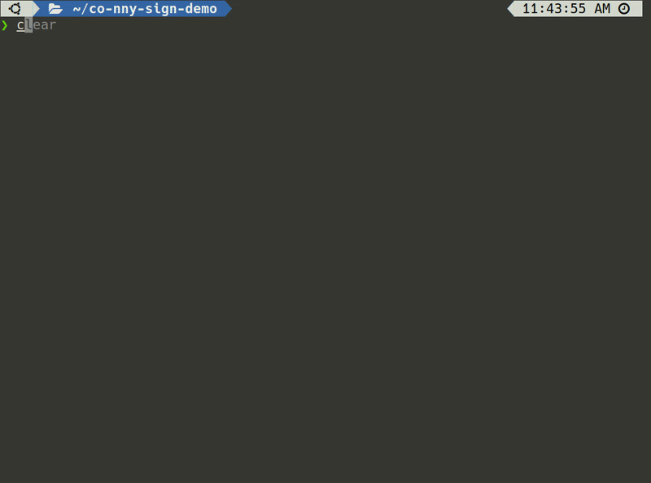

# Using Connaisseur with Cosign signatures

[Sigstore](https://sigstore.dev/) is a [Linux Foundation](https://linuxfoundation.org/) project that aims to provide public software signing and transparency to improve open source supply chain security. As part of the Sigstore project, [Cosign](https://github.com/sigstore/cosign) allows seamless container signing, verification and storage. You can read more about it [here](https://blog.sigstore.dev/cosign-signed-container-images-c1016862618).

Connaisseur currently supports the elementary function of verifying `cosign` generated signatures against the locally created corresponding public keys. We plan to expose further features of cosign in upcoming releases, so stay tuned!

> :warning: `sigstore` and `cosign` are currently in *pre-release* state and so is our support for them. We therefore consider this an *experimental feature*. As such, it is not part of our semantic versioning guarantees and we take the liberty to remove it with any version at any time without incrementing MAJOR or MINOR.

## Demo


## Signing Container Images with Cosign

> **NOTE**: You can also do a minimal test without installing `cosign` locally. In that case, skip this step and use our provided public key and `testimage`s below.

Getting started with `cosign` is very well described in the [docs](https://github.com/sigstore/cosign). Please check there for detailed instructions. In short: After installation a keypair is generated via:

```bash
cosign generate-key-pair
```

You will be prompted to enter a password, after which a private (`cosign.key`) and public (`cosign.pub`) key are created. You can then use cosign to sign a container image using:

```bash
# Here, $IMAGE is REPOSITORY/IMAGE_NAME:TAG
cosign sign -key cosign.key $IMAGE
```

You can then verify the created signature via:

```bash
cosign verify -key cosign.pub $IMAGE
```


## Configuring Connaisseur for Cosign Signatures

Setting up Connaisseur for `cosign` signatures only requires minor changes. In case of questions, please refer to the [default guide](README.md). In essence, you can just clone this repository:

```bash
git clone https://github.com/sse-secure-systems/connaisseur.git
cd connaisseur
```

Next, configure `Connaisseur` to use cosign and the previously created public key for validation via the `helm/values.yaml`.  To do so, copy your `cosign.pub` key into `notary.rootPubkey`. Here, at the example of our public key for our `testimage`s (you can also use this key and test with our images):

```bash
# Replace the actual key part with your own key
  rootPubKey: |
    -----BEGIN PUBLIC KEY-----
    MFkwEwYHKoZIzj0CAQYIKoZIzj0DAQcDQgAEvtc/qpHtx7iUUj+rRHR99a8mnGni
    qiGkmUb9YpWWTS4YwlvwdmMDiGzcsHiDOYz6f88u2hCRF5GUCvyiZAKrsA==
    -----END PUBLIC KEY-----
```

And set `notary.isCosign` to `true`:

```bash
  isCosign: true
```

You can then install `Connaisseur` via:

```bash
make install
```


## Test Signature Verification

You can now test signature verification by deploying the signed image from above:

```bash
kubectl run signed --image=$IMAGE
```

Or attempt to deploy another unsigned image.

For the lazy ones, you can configure our public key provided in the previous section and test with our signed `testimage`:

```bash
kubectl run signed --image=docker.io/securesystemsengineering/testimage:co-signed
```

and compare to the unsigned `testimage`:

```bash
kubectl run unsigned --image=docker.io/securesystemsengineering/testimage:co-unsigned
```

or a `testimage` signed with a different key:

```bash
kubectl run unsigned --image=docker.io/securesystemsengineering/testimage:co-signed-alt
```

Once finished, you can clean up your cluster via:

```bash
make uninstall
```


## End

Hope you enjoy the new feature and let us [know what you think](../CONTRIBUTING.md)!

We are working on improving support for `cosign` and `sigstore` features and will also be introducing [multi-key and multi-validator support](https://github.com/sse-secure-systems/connaisseur/pull/90) in the near future. So stay tuned!
