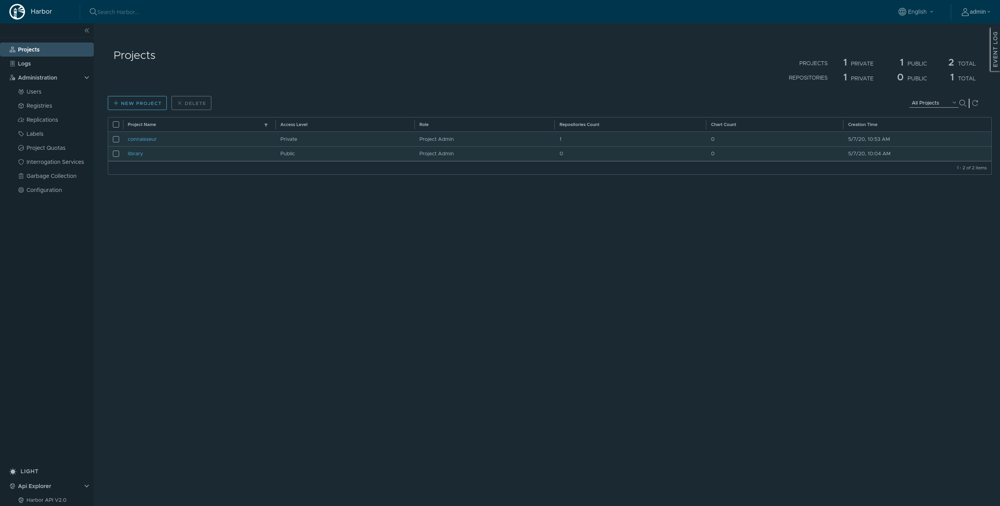
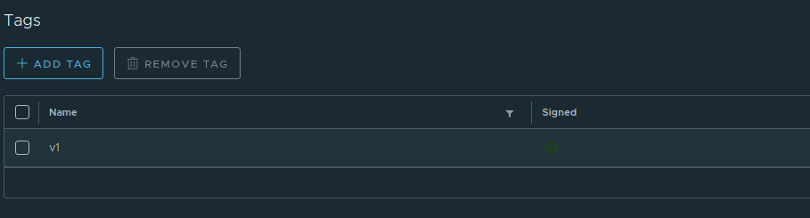

# Local Setup Guide
This guide describes setting up a completely local installation of Connaisseur using minikube paired with a local Harbor installation that combines registry and notary servers. This setup is a bit more cumbersome since it does not use existing public infrastructure such as PKI. However, it is entirely based on open-source solutions, does not require continuous access to the internet and you control every part of the installation. This makes it specifically suited e.g. for security researchers and users interested in the inner workings of DCT and Connaisseur.

>  Note: For quick testing, we recommend using the simple main [setup guide](../README.md) using Docker Hub.

> The setup guide was tested with a Linux Mint 19.2, but should work similarly on other Linux distros.

## Setup

### Prerequisites

Before you can start, some tools must be installed first, so everything can go on smoothly. Since Connaisseur is an addition to Kubernetes, a cluster is obviously needed. You can use any kind of Kubernetes service from different providers, such as *Azure* or *AWS*, but for the sake of this guide, a local [*minikube*](https://kubernetes.io/docs/tasks/tools/install-minikube/) instance (using virtualbox as driver) is being used.

> If you use a different driver such as docker, you may run into problems with minikube, i.e. DNS settings for Harbor and Notary not propagating. Hence, we _strongly recommend_ using the virtualbox driver (or an actual, full-fledged Kubernetes cluster) for doing this tutorial.

For accessing the cluster you'll also need the [*Kubernetes command-line tool*](https://kubernetes.io/docs/tasks/tools/install-kubectl/) and installation of new services/tools to Kubernetes is performed with [*helm3*](https://helm.sh/docs/intro/install/).

For building, pushing and signing container images, [*docker*](https://docs.docker.com/engine/install/) will be needed:

Finally you'll need *git* for cloning repositories used in this guide:

```bash
sudo apt-get install git
```

### Installing Harbor

When signing docker images, you need two things. First, an image registry that stores the images and second, a Notary server that stores the signature information. Conveniently, there is a service called *Harbor* that combines the two in a nice bundle, including additional functionalities such as container vulnerability scanning. We will be using it in the guide as it makes the setup a lot easier.

> Alternatively, should you already have an image registry and don't want to switch to Harbor, you can install Notary separately following the description in their [github repo](https://github.com/theupdateframework/notary). The Notary server needs to be connected to the same authentication server that your registry is using (if present) and only supports token authentication. It's not advised to use an unauthenticated Notary server. For the rest of this setup guide, it is assumed that Harbor is in use.

First off, clone the *harbor-helm* repository that holds all necessary resources for installing Harbor:

```bash
git clone https://github.com/goharbor/harbor-helm.git
cd harbor-helm
```

In the cloned repository you can find a `values.yaml` file, in which you can make some configuration changes, but for this guide keep things as they are. You should create a new namespace for the Harbor instance and then install it via `helm`:

```bash
kubectl create namespace harbor
kubectl config set-context --current --namespace harbor
helm install harbor .
```

After a few minutes Harbor should be running on your cluster. You can check whether all Pods/Depolyments are running with `kubectl get all`.

> The Harbor installation uses an _ingress_ to redirect all requests to the relevant components. So make sure an ingress controller is installed in the cluster. For minikube just check with `minikube addons list` and enable it with `minikube addons enable ingress`.

#### (Optional) Installing Certificates

One drawback of this simple setup is that Harbor is now using self-signed certificates, which will hinder further steps from executing successfully. As a workaround, you can install the self-signed certificates to get the real certificate experience.

First retrieve the certificate from its Kubernetes Secret and store it somewhere locally:

```bash
kubectl -n harbor get secrets harbor-harbor-ingress -o jsonpath="{.data['ca\.crt']}" | base64 -d > harbor-ca.crt
```

Second, install the certificate, both locally and in the cluster. For the local installation, create the two directories `/etc/docker/certs.d/core.harbor.domain` and `~/.docker/tls/notary.harbor.domain` and copy the certificate over:

```bash
sudo mkdir -p /etc/docker/certs.d/core.harbor.domain
mkdir -p ~/.docker/tls/notary.harbor.domain

sudo cp harbor-ca.crt /etc/docker/certs.d/core.harbor.domain
cp harbor-ca.crt ~/.docker/tls/notary.harbor.domain
```

Things get a bit more complicated when installing the certificate in the minikube cluster. To begin with, copy the certificate into your cluster using `scp`:

```bash
scp -i $(minikube ssh-key) harbor-ca.crt docker@$(minikube ip):~/harbor-ca.crt
```

Then ssh into your cluster and switch to the root user:

```bash
$ minikube ssh
                         _             _
            _         _ ( )           ( )
  ___ ___  (_)  ___  (_)| |/')  _   _ | |_      __  
/' _ ` _ `\| |/' _ `\| || , <  ( ) ( )| '_`\  /'__`\
| ( ) ( ) || || ( ) || || |\`\ | (_) || |_) )(  ___/
(_) (_) (_)(_)(_) (_)(_)(_) (_)`\___/'(_,__/'`\____)

$ sudo -s
$
```

Finally, create the `/etc/docker/certs.d/core.harbor.domain` directory and copy the certificate over:

```bash
mkdir -p /etc/docker/certs.d/core.harbor.domain
cp harbor-ca.crt /etc/docker/certs.d/core.harbor.domain
```

After that, exit minikube (enter `exit` twice).

Lastly, edit your local `/etc/hosts` file and add Harbor's and Notary's domain names in there with the IP address of your minikube cluster. That way you can access Harbor via its domain name and don't get into trouble with the certificate:

```bash
echo -e "\n$(minikube ip)\t\tcore.harbor.domain\n$(minikube ip)\t\tnotary.harbor.domain" | sudo tee --append /etc/hosts > /dev/null
```

### Signing images

#### Connect to registry

With Harbor installed and its domain name added to the `/etc/hosts` file, you can access it via `core.harbor.domain` in your web browser. Unfortunately, your browser won't accept the self-signed certificate, so you have to manually approve the connection. Click "More Information" (or something similar to this; this is different on each web browser) and then "Yes, I really want to visit this super insecure website". This should bring you to the Harbor login screen. Enter the default credentials: `admin` and `Harbor12345`.



You should now be seeing Harbor's main page. Go to "Administration -> Users" and click "+ New User", in order not to use the admin credentials all the time. Choose a name and password; we'll be using 'test' and 'Securesystems8' for this tutorial. Then create a new project in the "Projects" tab, we'll call it 'sample'. Click on the newly created project and add your new user to the list of members as a "Developer".

You can now login to the Harbor image registry by using the credentials of the `test`-user:

```bash
docker login --username="test" --password="Securesystems8" core.harbor.domain
```

Similar things have to be done for the cluster, so it can pull images from the registry. Thus, create an image pull secret:

> You probably want to change namespaces, so you don't create everything in the Harbor namespace. Use `kubectl config set-context --current --namespace default` to switch to the default namespace.

```bash
kubectl create secret docker-registry regcred --docker-server=core.harbor.domain --docker-username=test --docker-password=Securesystems8
```

#### Build unsigned image

To highlight the difference between signed and unsigned image, you'll first create a normal unsigned image and push it to the registry. Use this simple _python_ web server as your application code:

```python
from flask import Flask

app = Flask(__name__)


@app.route('/')
def hello_world():
    return 'Hello World! This is a normal docker image!'


if __name__ == '__main__':
    app.run(host='0.0.0.0')
```

Store this in `app.py` and build a docker image containing the code, using the following `Dockerfile`:

```bash
FROM python:3.7-alpine
WORKDIR /app
RUN pip install Flask
COPY app.py /app
ENTRYPOINT [ "python" ]
CMD [ "app.py" ]
```

Build the image and push it to the registry:

```bash
docker build -t core.harbor.domain/sample/unsigned-image .
docker push core.harbor.domain/sample/unsigned-image
```

> The image needs to be tagged as \<registry\>/\<repo>/\<image-name\>, whereas the _registry_ is the domain name of the image registry (`core.harbor.domain`), the _repo_ being the newly created project (`sample`) and _image-name_ an arbitrary name.

Now the image should reside in the registry. You can check that by using the Harbor web interface and you can start up a service in your cluster using this very image:

```bash
kubectl create -f - << EOF
apiVersion: apps/v1
kind: Deployment
metadata:
  name: sample-deployment
  labels:
    app: sample
spec:
  selector:
    matchLabels:
      app: sample
  replicas: 1
  template:
    metadata:
      labels:
        app: sample
    spec:
      containers:
      - name: sample
        image: core.harbor.domain/sample/unsigned-image
        imagePullPolicy: Always
        ports:
        - containerPort: 5000
      imagePullSecrets:
        - name: regcred
---
apiVersion: v1
kind: Service
metadata:
  name: sample
  labels:
    app: sample
spec:
  ports:
  - name: port
    port: 8080
    targetPort: 5000
  selector:
    app: sample
  type: LoadBalancer
EOF
```

The command `minikube service list -n default` should now provide you with a URL that will direct you to your web server.

#### Build signed image

Now starts the exciting part: the image signing. Change up the application code a bit, in order to better differentiate the signed and unsigned version. You can use the same code from above, just modify the `hello_world` method a bit.

```python
def hello_world():
    return 'Hello World! This is a signed docker image!'
```

Build the new image, but don't push it to the registry yet! Also choose a new name for the image and give it a tag, since only images with tags can be signed:

```bash
docker build -t core.harbor.domain/sample/signed-image:v1 .
```

Before you can push the image to the registry, you'll have to activate _Docker Content Trust_ (DCT), which will sign the image for you, once you push it. Activate it by setting the `DOCKER_CONTENT_TRUST` environment variable to `1` and set `DOCKER_CONTENT_TRUST_SERVER` to your Notary instance:

```bash
export DOCKER_CONTENT_TRUST=1
export DOCKER_CONTENT_TRUST_SERVER=https://notary.harbor.domain
```

> The reason for doing this after the image has been built, is due to the fact that once Docker Content Trust is active, the docker client will only pull images that are signed based on the signing data from the Notary server. The built image uses `python:3.7-alpine` as basis, which needs to be pulled and, since the Harbor Notary instance is completely empty, has no signing data. Therefore the building process would fail, if DCT was activated beforehand.

Now you can push the image, which will also sign it at the same time:

```bash
docker image push core.harbor.domain/sample/signed-image:v1
```

Since the Notary instance inside Harbor is completely empty, you will be prompted to setup a passphrase for a `root` and `targets` key. These keys are being generated for you and are used to create the image signature. The `root` key is the source of all trust and is needed whenever you are trying to sign a new image repository. The `targets` key will be needed for all changes within a repository. Both private parts of the keys are stored on your machine, in the `~/.docker/trust/private` directory, encrypted with your passphrases. The public parts reside on the Notary server.

That's it, you signed an image. You can verify this in the Harbor web interface by navigating to your 'sample' project -> 'Repositories' -> 'sample/signed-image' -> 'v1', where you should get an overview of the image. There should be an indicator confirming that the image is indeed signed.



Same as before, you can start up the image in your cluster using the code from above, but make sure you change the image reference and name of the deployment as well as the service (`metadata` -> `name`).

### Installing Connaisseur

> Before installing Connaisseur, you may want to clean up the testing services of your two images. Just run `kubectl delete all -lapp=sample`

It is time to finally deploy **Connaisseur**. Clone the repository to an appropriate location and `cd` into it:

```bash
git clone https://github.com/sse-secure-systems/connaisseur.git
cd connaisseur
```

In there, you will find a `helm` directory, which holds a `values.yaml` file, which needs to be configured. Add a new notary configuration with all appropriate values. The `selfsigned_cert` field should be filled with the contents of the `harbor-ca.crt` from earlier.

```yaml
notaries:
- name: dockerhub
  ...
# -- Add this ------
- name: harbor
  host: notary.harbor.domain
  selfsigned_cert: |
    -----BEGIN CERTIFICATE-----
    -----END CERTIFICATE-----
  auth:
    user: test
    password: Securesystems8
  root_keys:
  - name: default
    key: |
      -----BEGIN PUBLIC KEY-----
      -----END PUBLIC KEY-----
# ------------------
```

For the `notaries[1].root_keys[0].key` field, you need the public part of the Notary's `root` key. Its private component resides in your `~/.docker/trust/private` directory. With `openssl` you can get the public part form it, but you'll need to provide the passphrase you set, when generating the key:

```bash
cd ~/.docker/trust/private
KEY_PATH=$(grep -iRl "role: root$" .)
KEY_ID=$(basename -s .key $KEY_PATH)
sed '/^role:\sroot$/d' $KEY_PATH > root-priv.key
openssl ec -in root-priv.key -pubout -out root-pub.pem
cd -
```

Copy the contents of the public key into the `notaries[1].root_keys[0].key` field of the `helm/values.yaml`. The create a new rule in the `policy` field of the `helm/values.yaml`, matching all images coming from the harbor registry, referencing harbor's notary.

```yaml
policy:
- pattern: "*:*"
  ...
# -- Add this ------
- pattern: "core.harbor.domain/*:*"
  verify: true
  notary: harbor
  key: default
# ------------------
```

And with that, everything is ready to install Connaisseur. Use the repository's `Makefile`:

```bash
$ make install
bash helm/certs/gen_certs.sh
Generating RSA private key, 4096 bit long modulus (2 primes)
.............................++++
.................................................................++++
e is 65537 (0x010001)
Generating RSA private key, 4096 bit long modulus (2 primes)
..++++
.....++++
e is 65537 (0x010001)
Signature ok
subject=CN = connaisseur-svc.connaisseur.svc
Getting CA Private Key
kubectl create ns connaisseur || true
namespace/connaisseur created
kubectl config set-context --current --namespace connaisseur
Context "minikube" modified.
helm install connaisseur helm --wait
NAME: connaisseur
LAST DEPLOYED: Fri May 29 15:30:52 2020
NAMESPACE: connaisseur
STATUS: deployed
REVISION: 1
TEST SUITE: None
```

When this is done, Connaisseur should be up and running in the `connaisseur` namespace. Check with `kubectl get all -n connaisseur`.

```bash
$ kubectl get all -n connaisseur
NAME                                          READY   STATUS    RESTARTS   AGE
pod/connaisseur-deployment-6d579b4946-w98fw   1/1     Running   0          18s
pod/connaisseur-deployment-6d579b4946-1337a   1/1     Running   0          18s
pod/connaisseur-deployment-6d579b4946-deadb   1/1     Running   0          18s

NAME                      TYPE        CLUSTER-IP      EXTERNAL-IP   PORT(S)   AGE
service/connaisseur-svc   ClusterIP   10.111.126.76   <none>        443/TCP   18s

NAME                                     READY   UP-TO-DATE   AVAILABLE   AGE
deployment.apps/connaisseur-deployment   3/3     3            3           18s

NAME                                                DESIRED   CURRENT   READY   AGE
replicaset.apps/connaisseur-deployment-6d579b4946   3         3         3       18s
```

After switching back to the default namespace (`kubectl config set-context --current --namespace default`), try applying the two images you built before. Start off with the unsigned one to verify it will be rejected by Connaisseur. Applying it should give the following error:

```bash
service/sample created
Error from server: error when creating "STDIN": admission webhook "connaisseur-svc.connaisseur.svc" denied the request: no trust data for image "core.harbor.domain/sample/unsigned-image:latest".
```

As expected, Connaisseur blocks the creation of the deployment, since the image used isn't signed. Success!

> Note that the service still gets created, as it has no image reference and is considered harmless for Connaisseur.

On the contrary, everything should work just fine with the signed image as it has a signature. See for yourself:

```bash
kubectl create -f - << EOF
apiVersion: apps/v1
kind: Deployment
metadata:
  name: sample-deployment
  labels:
    app: sample
spec:
  selector:
    matchLabels:
      app: sample
  replicas: 1
  template:
    metadata:
      labels:
        app: sample
    spec:
      containers:
      - name: sample
        image: core.harbor.domain/sample/signed-image:v1
        imagePullPolicy: Always
        ports:
        - containerPort: 5000
      imagePullSecrets:
        - name: regcred
---
apiVersion: v1
kind: Service
metadata:
  name: sample
  labels:
    app: sample
spec:
  ports:
  - name: port
    port: 8080
    targetPort: 5000
  selector:
    app: sample
  type: LoadBalancer
EOF
```

You should see the successful deployment of your resources:

```bash
deployment.apps/sample-deployment created
service/sample created
```

There you go. Now your cluster is protected from any attacker, who got `kubectl` access and wants to deploy random images. It also protects from attackers sitting inside you registry, who are redirecting image tags away from their corresponding digests.
